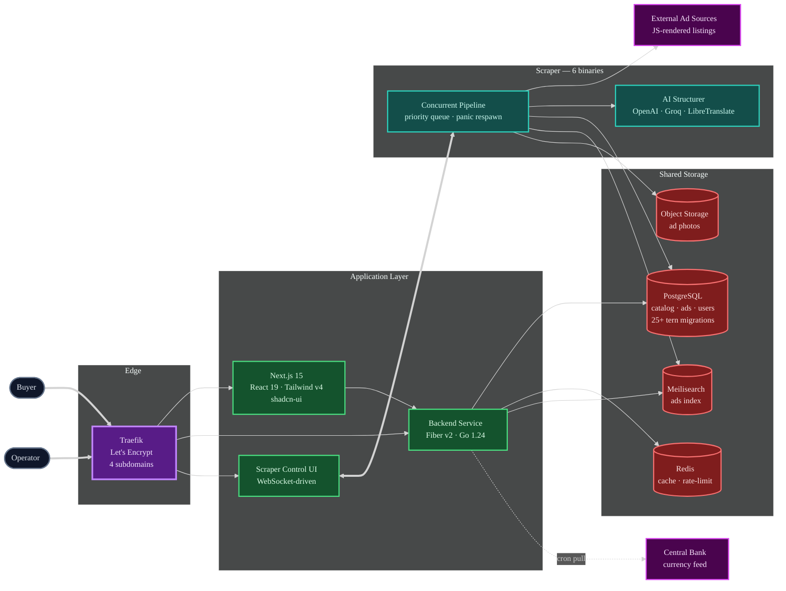
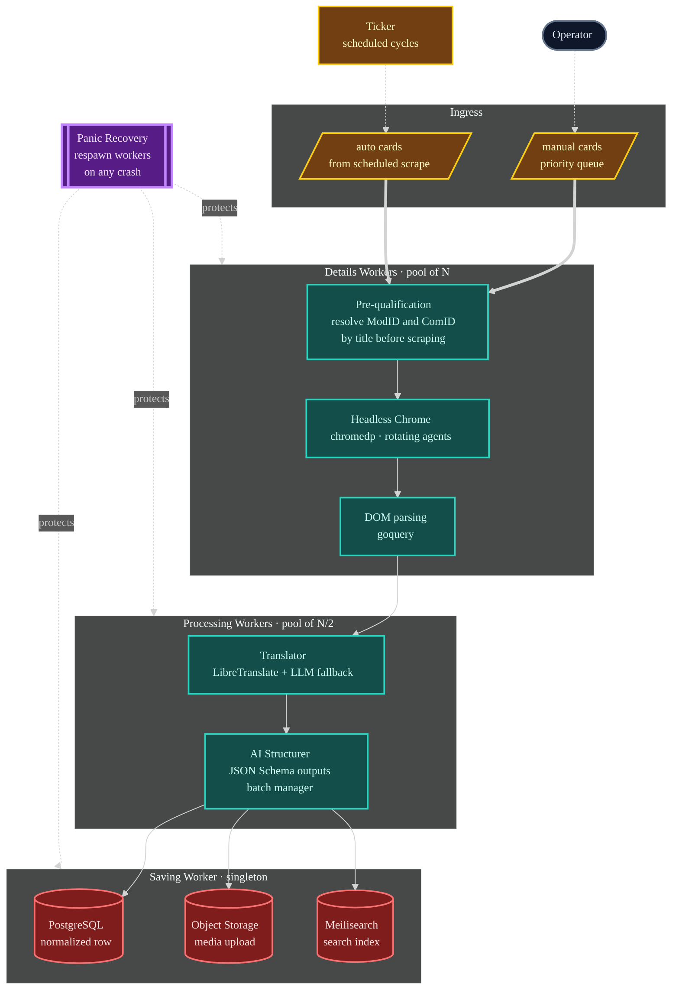
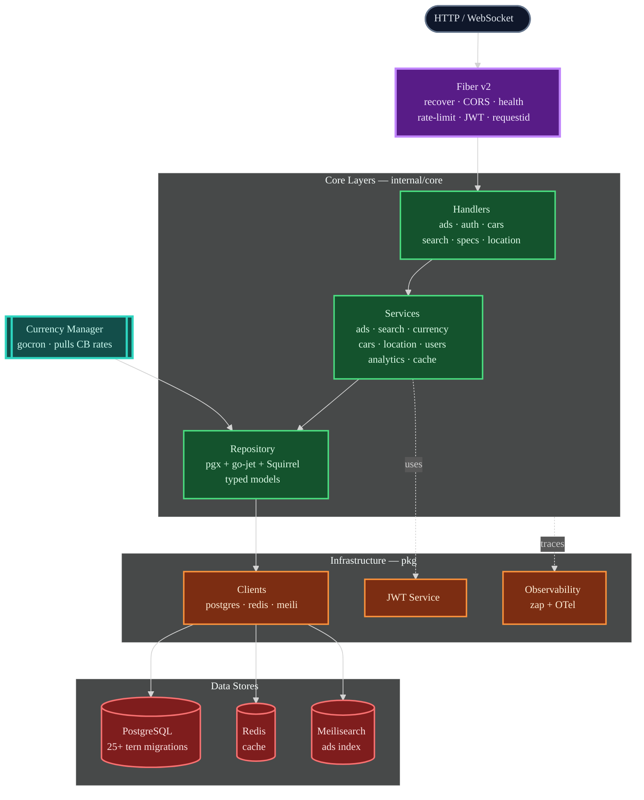

# Araxes

> Commercial classifieds platform for imported cars — a Go backend with a deep five-level catalog, a concurrent Go scraper with LLM-powered data structuring, and a Next.js frontend with proper grammatical-case handling for its target language.


---

## Contents

- [The Problem](#the-problem)
- [Overview](#overview)
- [Architecture](#architecture)
  - [System Overview](#system-overview)
  - [Scraping Pipeline](#scraping-pipeline)
  - [Backend Layered Architecture](#backend-layered-architecture)
- [The Scraping Pipeline — Deep Dive](#the-scraping-pipeline--deep-dive)
  - [Six Specialized Binaries](#six-specialized-binaries)
  - [The Concurrent Pipeline](#the-concurrent-pipeline)
  - [AI-Powered Data Structuring](#ai-powered-data-structuring)
  - [Translation and Media](#translation-and-media)
  - [Operational Control via a WebSocket UI](#operational-control-via-a-websocket-ui)
- [Backend Service](#backend-service)
  - [Domain Model — the Five-Level Car Catalog](#domain-model--the-five-level-car-catalog)
  - [Layered Architecture](#layered-architecture)
  - [REST API Surface](#rest-api-surface)
  - [Currency Auto-Refresh](#currency-auto-refresh)
  - [Search and Relaxed Search via Meilisearch](#search-and-relaxed-search-via-meilisearch)
- [Frontend — Next.js 15](#frontend--nextjs-15)
- [Infrastructure & Deployment](#infrastructure--deployment)
- [Tech Stack](#tech-stack)
- [What I Learned](#what-i-learned)
- [Status](#status)

---

## The Problem

A classifieds platform for imported cars lives or dies on the quality of its data, and the data never arrives clean. Listings come from external sources written in a foreign language, with free-text descriptions, inconsistent spec formats, and catalog identifiers that do not match any normalized database. Prices are quoted in the source currency and have to be converted to the target currency with reasonably current rates. The target audience speaks a language that has grammatical gender, six cases, and three plural forms — so even something as simple as *"3 cars found"* requires grammatical machinery that most i18n libraries won't give you. None of this work is visible to a buyer scrolling through a results page, but all of it has to be right before the page is worth scrolling.

Araxes is the platform that does that work. It ingests ads from external sources, translates and structures them through a multi-stage concurrent pipeline with LLM-backed field extraction, normalizes them into a five-level car catalog with five specialised spec tables per complectation, serves them through a typed REST API with Meilisearch-backed relaxed search, and renders them in a frontend that knows how to decline a car model name in the genitive case.

---

## Overview

Araxes is a **three-component commercial project** — one backend, one scraper, one frontend — all written personally by me and deployed behind Traefik on a Russian cloud provider's infrastructure at `araxes.ru`. Each component is a separate repository coordinated by shared conventions and tern migrations:

- **Backend** — Go 1.24, Fiber v2, `pgx/v5` with `go-jet` for type-safe generated queries and `Masterminds/Squirrel` for dynamic ones, Redis for cache, Meilisearch for full-text search, JWT for auth, `gocron/v2` for scheduled work, OpenTelemetry for tracing, 40+ REST endpoints across ads / search / cars catalog / specs / locations / currencies.
- **Scraper** — Go 1.24, six specialised CLI binaries sharing one internal package tree, with `chromedp` for headless-Chrome scraping of JS-rendered pages, `PuerkitoBio/goquery` for DOM parsing, `openai-go/v2` and `groq-go` for LLM-based structured data extraction driven by `invopop/jsonschema`, `libretranslate` as a cheaper translation fallback, `aws-sdk-go-v2/s3` for media uploads, and a `gorilla/websocket` backed web control surface for live operation.
- **Frontend** — Next.js 15.4, React 19.1, Tailwind v4, shadcn-ui on top of Radix, `next-auth` v4, TanStack Table and Virtual for admin grids, `zod` for validation, and — the interesting bit — `petrovich` and `pluralize-ru` for **grammatically-correct rendering** of model names and result counts in the target language.

The interesting technical story is the **scraping pipeline**. The backend is a disciplined layered REST service — clean, tested, and deliberately boring in the way backends should be. The frontend is a polished Next.js app with one unusual grammar-handling quirk. But the scraper is where the engineering lives: it is a hand-built concurrent Go pipeline with priority-draining queues, pre-qualification filters, panic-recovering workers, LLM-driven data structuring, and an operational control plane exposed over WebSocket. That is the part this README spends the most time on.

---

## Architecture

Three diagrams: how the three components fit together and exchange data, how the scraper's internal pipeline flows from an external URL to a saved row, and how the backend is layered from HTTP handler to database row.

### System Overview

The three components are loosely coupled: the scraper writes into the shared Postgres + Meilisearch + S3 storage, and the backend reads from that storage to serve the frontend. The only synchronous coupling is at the edge — Traefik terminates TLS and routes public traffic across the backend, the frontend, and a media proxy. The Central Bank rate feed is a scheduled pull on the backend's own timer, not driven by any user request.



### Scraping Pipeline

Inside the scraper's main `ads` binary. A scraping cycle is driven by a ticker on the main loop, which fills the `cards` channel with new URLs to process. Three worker pools drain channels downstream: details workers fetch and parse each ad's full page through headless Chrome, processing workers call the AI structurer and translator, and the saving worker commits the normalized result into Postgres, Meilisearch, and S3 in one transaction. A separate `manual` channel feeds priority URLs that an operator has submitted through the WebSocket control UI; the details workers drain it non-blockingly ahead of the scheduled cycle, so manual tasks always jump the queue.



### Backend Layered Architecture

A classical layered Go backend, deliberately kept simple. Every request enters through Fiber v2 middleware (recovery, CORS, health check, rate limit, JWT auth, request ID), hits a typed handler, which calls a service, which calls a repository, which talks to Postgres (through `go-jet`'s generated type-safe queries or `Squirrel`'s dynamic builder depending on whether the shape is fixed or computed), plus Redis for cache and Meilisearch for search. A separate `CurrencyManager` runs on its own schedule through `gocron/v2` and writes updated rates into the same Postgres.



---

## The Scraping Pipeline — Deep Dive

This is the section that makes Araxes technically interesting. Everything else is well-executed craft; this is the engineering that would not exist if I had grabbed Colly and called it a day.

### Six Specialized Binaries

The scraper is not one program — it is **six specialised CLI binaries** sharing one internal module tree:

| Binary | Responsibility |
|---|---|
| **`ads-scraper`** | The main ad pipeline. Walks external listings, fetches each ad's detail page, processes and saves. This is the one that runs continuously. |
| **`brands-scraper`** | One-shot scrape of the source catalog's brand index. |
| **`brands-parser`** | Parses the scraped brand data into the normalized `brands` / `models` / `generations` tables. |
| **`specs-scraper`** / **`specs-scraper-v2`** | Two generations of the car-specification scraper. The v2 rewrite uses a cleaner pipeline shape and retired the v1 approach; both remain in the tree because the v1 output is still useful as a ground-truth dataset for validating the v2. |
| **`matches-indexer`** | Post-processing step that correlates scraped ad modifications with the canonical catalog rows, populating the `modification_matches` join table that powers the search experience. |

Splitting into specialised binaries matters because the scraping domain has *very* different runtime profiles — the brand index changes roughly monthly, specs change per model-year, and ads arrive constantly. Running them all inside one long-lived process would force the cadence of one onto the other, which is how you end up re-scraping a million ad pages because you wanted to refresh one brand's spec sheet. Keeping them apart is not micro-service cosplay — it is acknowledging that they are genuinely different jobs.

### The Concurrent Pipeline

The `ads-scraper` binary runs the most intricate of the six. It is a four-stage pipeline with three worker pools, coordinated by a handful of buffered channels and a weighted semaphore, and every single stage is designed to survive failures that production scraping always produces: timeouts, crashed browser tabs, rate-limited source pages, parser panics on malformed DOM, LLM API outages.

**Four channels, three worker pools.** A ticker on the main loop runs a scrape cycle every configured interval: fetch the current card listings, dedupe against already-processed IDs, and push new cards onto the `cards` channel. A pool of **details workers** pulls from `cards`, acquires a slot on the shared semaphore, drives `chromedp` to load the detail page, parses the DOM with `goquery`, and forwards the result onto the `details` channel. A smaller pool of **processing workers** drains `details`, runs translation and LLM structuring, and emits a fully-populated record onto the `processed` channel. A single **saving worker** drains `processed` and commits each record across Postgres, Meilisearch, and S3 in one transaction. Each pool size is configurable, but the shapes are deliberately asymmetric — more details workers than processing workers, because chromedp is the bottleneck, and a single saving worker because the write path is naturally serialised around the database transaction.

**Priority draining for manual URLs.** A parallel `manual` channel exists alongside `cards`. The scraper's web control UI lets an operator paste a specific ad URL and watch it be processed end-to-end in real time — useful for debugging a failing source page, re-running a suspect listing, or hand-verifying that a recent parser fix actually works. When a details worker is ready for the next task, it drains the manual channel **non-blockingly** first, and only falls through to the scheduled `cards` queue when `manual` is empty. Manual tasks therefore always jump the queue without starving the scheduled cycle, and the operator gets first-class latency on the URL they just asked about. A `ManualTaskTracker` interface emits `started` / `completed` events so the web UI can stream status back to the operator over WebSocket.

**Panic-recovering workers.** Production scraping means strange, unreliable inputs — truncated HTML, encoding artifacts, source-page layout changes, LLM responses that violate their own JSON schema. A single unhandled panic in a worker goroutine should not take down the pipeline, so every worker main-loop is wrapped in a `recoverAndRespawn` helper that catches the panic, logs the stack trace, increments an error counter, and **respawns a fresh goroutine for the same worker** before returning. The pipeline self-heals instead of grinding to a halt, and the error count surfaces in the stats panel so an operator notices the bleed.

**Pre-qualification.** Before ever invoking chromedp on a card's detail page, the worker tries to resolve the ad's `ModID` and `ComID` (modification and complectation primary keys) from the *listing-level title alone*, which is the one field available without a second HTTP request. If the resolution succeeds, the details scrape goes ahead; if it fails — meaning this listing doesn't match any known car in the catalog — the card is marked processed, the skip counter is incremented, and the worker moves on **without ever spending browser time on the detail page**. On a noisy source with broad model coverage, this pre-qualification is what turns the pipeline from "running chromedp on every garbage ad" into "running chromedp only on ads we already know we can place in the catalog".

**Bounded concurrency via `semaphore.Weighted`.** The total number of simultaneously-in-flight chromedp browser instances is capped at the configured concurrency limit, regardless of how many workers are spinning. This prevents a surge of incoming manual tasks from accidentally fork-bombing headless Chrome.

**Graceful shutdown.** Stop signals flip the running flag, cancel the root context, wait on the worker WaitGroup with a thirty-second timeout, and close all four channels in order. If the workers don't all finish within the timeout, the scraper logs a warning and forces the shutdown — the one case where data loss is acceptable because the alternative is blocking an operator's Ctrl-C forever.

### AI-Powered Data Structuring

Somewhere between *"the DOM parsed cleanly"* and *"the row landed in Postgres"* the pipeline has to deal with one unavoidable reality: the source ad is written in free-form natural language. The mileage might be "45,000 km" or "45K km" or "45 тыс. км"; the engine might be a `2.0L turbo` or a `2.0T` or just `2.0`; the trim level might be named half a dozen different ways. No amount of regex survives this. So the pipeline hands each scraped ad to an **AI structurer** whose job is to turn the free-form blob into a typed record.

The structurer wraps two LLM clients — `openai-go/v2` and `groq-go` — behind one `Integrator` abstraction, and drives both with `invopop/jsonschema`-generated JSON Schemas that describe the exact shape of the normalized ad row. The LLM is told *"respond with JSON that matches this schema"* instead of being asked to write free prose, so the output slots directly into the Go struct with no post-processing. When the LLM produces a field the schema doesn't expect, the unmarshaller rejects the response and the pipeline falls back to either a cheaper model or a lower-confidence parse path.

A separate `batch_manager.go` groups multiple ad-structuring requests into single LLM calls when the volume is there, which is the only reason the LLM cost on this project is survivable. The batch manager tracks a configurable window of pending requests, flushes when either the window fills or a timeout elapses, and returns the per-request results back to the calling workers through a fan-out. In a long scraping run, batching cuts the per-ad LLM cost meaningfully without introducing observable per-ad latency.

### Translation and Media

Translation runs **in front of** the structurer — raw text first gets translated from the source language into the target language, then the structurer extracts fields from the translated text. The translation path preferentially uses a self-hosted **LibreTranslate** instance (open-source, unlimited, free) and falls back to an LLM-driven translation only when LibreTranslate fails or the source text is too messy for its model. The LLM path is more expensive but more tolerant of formatting noise, which matters when a source page embeds specs inside Chinese-style bracketed fragments.

Media handling is a parallel path. Each ad detail page surfaces a set of photo URLs, which the saving worker streams through the **AWS S3 SDK v2** into object storage under a deterministic key scheme tied to the ad's dealer pair, updates the ad row with the uploaded URLs, and ensures the Meilisearch index carries pointers to the stored media rather than to the original source URLs (which rot).

### Operational Control via a WebSocket UI

The scraper ships with its own **local web control surface** exposed over `gorilla/websocket`. It is not a dashboard for end users — it is an operator's cockpit for the scraper itself: submit a specific URL to the priority queue, watch its journey through the pipeline stage by stage in real time, inspect the current pipeline stats (total processed, new ads, skipped, errors, last run time, average run time per cycle), configure the minimum model-year filter without a restart, and trigger a scraping cycle on demand. The `ManualTaskTracker` interface is what the pipeline calls to notify the UI of per-task status transitions; the UI subscribes once and receives a stream of `started` / `completed` events for every manual URL.

The scraper was designed to run continuously, autonomously, for days at a time — and the control UI is what makes that actually practical. Without it, operating a long-running scraper means grepping logs and praying; with it, you can observe the pipeline's behaviour live and correct it without stopping it.

---

## Backend Service

### Domain Model — the Five-Level Car Catalog

The most interesting part of the backend is not the code — it is the schema. A car classifieds catalog has to represent the actual taxonomy of cars, which is deeper than most people expect. Araxes uses the honest five-level hierarchy:

```
Brand    →   Model    →   Generation    →   Modification    →   Complectation
e.g.     Toyota   Camry      XV70 (2017-…)     2.5 Hybrid e-CVT    Executive
```

Every level has its own table with a parent FK, its own full CRUD endpoints, and its own lookup queries in the API. A listing attaches at the **complectation** level, which is the leaf node — because only the complectation has enough information to answer questions like *"how big is the fuel tank"* or *"does this trim come with a sunroof"*.

On top of that, every complectation gets **five specification tables**, each normalized into its own schema:

| Spec table | What it captures |
|---|---|
| **`body_specs`** | Body type, doors, seats, cargo volume, drag coefficient |
| **`engine_specs`** | Displacement, power, torque, fuel type, cylinder layout |
| **`transmission_specs`** | Transmission type, gear count, drivetrain |
| **`performance_specs`** | 0-100 km/h, top speed, fuel consumption (city / highway / combined) |
| **`dimension_specs`** | Length, width, height, wheelbase, ground clearance, turning radius |

A `modification_options` join table maps complectations to the optional equipment available on that trim, and a `modification_matches` table (populated by the scraper's `matches-indexer` binary) correlates scraped ads back to the canonical complectation rows — which is what makes *"find me similar ads"* and *"ads for this exact complectation"* actually return precise results instead of fuzzy matches.

All of this is managed through **25+ tern migrations** under `migrations/`, applied automatically on startup by a dedicated `migrator` Docker image that runs once before the backend container boots.

### Layered Architecture

The backend follows a standard four-layer Go architecture, and I kept it standard on purpose. A product like this lives for years, gets handed off between people, and gains dozens of endpoints over time — the less clever the architecture, the longer it stays maintainable.

- **`internal/core/handlers`** — Fiber v2 HTTP handlers. One file per domain (`ads.go`, `auth.go`, `cars.go`, `currencies.go`, `location.go`, `search.go`, `specs.go`), one function per endpoint, no business logic. Parse, validate, call service, serialize.
- **`internal/core/services`** — business logic. `ads`, `analytics`, `cache`, `cars`, `currency`, `location`, `search`, `users`, plus a top-level `service.go` that wires the others together. The `CurrencyManager` and `SearchEngine` are their own standalone services.
- **`internal/core/repository`** — data access. Per-domain files (`ads.go`, `cars.go`, `currencies.go`, `location.go`, `specs.go`, `users.go`), plus `cache/` and `db/` subtrees for the per-store adapter code, and an `interfaces.go` that fixes the contracts so services depend on interfaces and not on concrete types.
- **`internal/core/entities`** — typed domain models (`ad.go`, `analytics.go`, `car.go`, `colors.go`, `currency.go`, `locations.go`, `search.go`, `seller.go`, `user.go`). These are the shapes the services talk in.

Underneath all of this sits a `pkg/` tree with **13 in-house libraries** that every layer reuses — `clients` (typed Postgres / Redis / Meili factories), `collections`, `concurrent`, `dbx` (my signature database layer, same one I reuse across projects), `encrypts`, `errors`, `jwt`, `middlewares`, `models`, `observability`, `searchquery` (the custom query builder that powers the search API's filter DSL), and `validate`. Raw third-party clients never leak into the handler layer — every cross-boundary call goes through something in `pkg/` first.

### REST API Surface

The backend exposes **~40 REST endpoints** under `/api/v1`, organized into six resource groups. Below is the shape, not an exhaustive list:

| Group | Endpoints |
|---|---|
| **Ads** | `GET /ads` (faceted search), `GET /ads/:id` (full detail), `GET /ads/:id/similar` (neighbourhood search) |
| **Search** | `GET /search/ads/count`, `GET /search/ads/relaxed` (fallback widening), `GET /search/ads/suggest` (autocomplete) |
| **Recommendations** | `GET /recommendations/ads` (per-user personalised feed) |
| **Cars catalog** | Full CRUD on `brands`, `models`, `generations`, `modifications`, `complectations` — all five levels, with GET / POST / PUT per level |
| **Specs** | Full CRUD on the five per-complectation spec tables (`body`, `engine`, `transmission`, `performance`, `dimensions`) |
| **Locations** | GET + POST + PUT on `countries` and `cities`, with `GET /countries/:id/cities` for nested lookup |
| **Currencies** | `GET /currencies/rates` — the latest rates from the currency manager's most recent pull |

Authentication is JWT-based, applied as Fiber middleware on the `api.Group("/api/v1")` — so every endpoint below that group inherits the auth check, and unauthenticated routes sit outside the group. An `X-API-Key` header is required for administrative mutations on top of the JWT, so an ordinary user token cannot create a new brand or update spec tables even if it leaks.

### Currency Auto-Refresh

Imported car pricing needs current exchange rates, and pricing stale by a day is an embarrassment. The backend runs a **`CurrencyManager` service** wired through `gocron/v2` that fires at a configurable interval (3 hours by default), pulls the latest rates from the Central Bank's public JSON feed, and upserts them into a Postgres `currencies` table. The `/currencies/rates` endpoint reads from that table, so the user-facing response is always a cached read and never waits on an external call.

The cron lifecycle is tied to the server's own start / stop signals through the `closer` utility from my personal `gopherbox` library: `currencyManager.Start()` is called during `NewServer()` and the stop function is pushed onto the closer, so shutdown deregisters the job cleanly before the Postgres pool is closed.

### Search and Relaxed Search via Meilisearch

The search path is two-tier. The primary `GET /search/ads` endpoint runs a straight typed-filter query against Postgres with all the requested constraints (brand, model, generation, price range, mileage range, location, etc.). When that query returns too few results — say the user asked for "2022 Toyota Camry, hybrid, black, Moscow, under 2M" and nothing matches — the backend falls through to the **relaxed search** endpoint `GET /search/ads/relaxed`, which reruns the query against **Meilisearch** with progressively dropped constraints until enough results come back. The caller gets back a result set *and* a list of which constraints were relaxed to get it, so the frontend can show the user "we couldn't find exactly that, here are close alternatives without the hybrid filter".

The autocomplete endpoint `GET /search/ads/suggest` is a pure Meilisearch call — it's fast, typo-tolerant, and knows how to rank by frequency of matching ads, which is exactly what Meilisearch is good at.

---

## Frontend — Next.js 15

The frontend is a single Next.js 15.4 app under the App Router with route groups for `(admin)` and `(ads)`, plus a handful of top-level marketing and SEO landing pages. Tech stack:

| Layer | Stack |
|---|---|
| **Framework** | Next.js 15.4 · React 19.1 · TypeScript 5 · Turbopack dev server |
| **Styling** | Tailwind CSS v4 · shadcn-ui on top of Radix UI · `tailwind-merge` · `tw-animate-css` |
| **Auth** | `next-auth` v4, integrated against the backend's JWT issuance |
| **Forms & Validation** | `zod` v4 end-to-end, shared schemas between form input and API contracts |
| **Data UI** | TanStack Table v8 + TanStack Virtual v3 for admin grids with thousands of rows |
| **Icons** | `lucide-react` + `react-icons` + `@remixicon/react` |
| **Interaction** | `cmdk` (command palette), `embla-carousel-react` (image sliders), `vaul` (mobile drawers), `react-resizable-panels` |
| **Theming** | `next-themes` for dark mode |
| **Language tooling** | **`petrovich`** and **`pluralize-ru`** — see below |

The one quirk worth pulling out is the **grammatically-correct rendering of target-language text**. Languages with grammatical case require declining noun forms depending on syntactic role — for example, showing `"3 cars found"` vs. `"3 of <brand>'s cars found"` requires the brand name to be in a different case in each sentence, which no off-the-shelf i18n library handles. `petrovich` is a library that performs proper morphological declension of nouns and proper names, and `pluralize-ru` handles the three-form plural agreement (`1 машина / 2 машины / 5 машин`). Using both is how you make the frontend stop looking like a machine-translated knockoff — a detail that the target-language audience notices immediately even if they cannot explain *why* it feels wrong.

The App Router is organised with route groups for `(admin)` (admin console, gated on role) and `(ads)` (the ad listing and detail surface), plus top-level folders for `auth/`, `cars/`, a search `podbor/` page, a `kalkulyator/` (calculator) for cross-border pricing, a `modelnyy-ryad/` (model lineup) catalog browser, and several SEO-optimized landing pages for long-tail search queries. The separation between `(admin)` and `(ads)` is a route-group parenthesis, so both groups share a root layout but present completely different chrome without any URL prefix.

---

## Infrastructure & Deployment

The project ships with a full production deployment story, not just a `docker run`. Four moving pieces:

- **Docker Compose split into `local` and `production`.** `deploy/local.docker-compose.yaml` brings up the whole stack for development; `deploy/production.docker-compose.yaml` is the live prod topology with Traefik, the backend, the frontend, the migrator, and the infrastructure services. The compose files are kept separate so that iterating on dev never risks touching prod config by accident.
- **Traefik as the edge router with Let's Encrypt.** Terminates TLS, handles HTTP-to-HTTPS redirection, and routes traffic across **four subdomains**: the main site, the API, the media proxy, and the Traefik dashboard itself. Certificates are issued automatically on first boot through the ACME HTTP-01 challenge, and the `letsencrypt` volume persists them across restarts so the renewal cycle does not re-trigger ACME.
- **Selectel Registry as the production container registry.** A dedicated PowerShell script (`deploy/push-to-selectel.ps1`) handles the end-to-end flow — checking local images exist, tagging them with both the version and `latest`, pushing all three images (`autos-server`, `autos-frontend`, `autos-migrator`) to `cr.selcloud.ru/araxes-regitry`, and reporting status — so cutting a new version is one command instead of a checklist.
- **`tern` for database migrations.** A dedicated `tern.dockerfile` builds a single-purpose migrator image that runs `tern migrate` against the Postgres pool and exits. The production compose file runs it as a one-shot service before the backend starts, so every production deploy guarantees the schema is current before the first HTTP request is served. Migrations themselves live in `migrations/` — 25+ files in numbered order covering the full schema.

The production README documents all of this, including the DNS A-record requirements for the four subdomains, the Let's Encrypt rate-limit recovery procedure, the manual certificate cleanup procedure, the Traefik dashboard credentials setup, and the troubleshooting workflow for the common failure modes. It is the kind of document you write once, at three in the morning, after the first production deploy has taught you which seven things always break.

---

## Tech Stack

| Layer | Technology |
|---|---|
| **Backend Language** | Go 1.24 |
| **Backend Framework** | Fiber v2 with recover, CORS, health check, rate limit, JWT, requestid, pprof (local only) |
| **Database** | PostgreSQL via `pgx/v5`, with `go-jet` for type-safe generated queries and `Masterminds/Squirrel` for dynamic ones |
| **Migrations** | `tern` (dedicated Docker image) |
| **Cache** | Redis via `go-redis/v9` with `redisotel` tracing |
| **Search** | Meilisearch via `meilisearch-go` |
| **Auth** | JWT v5, plus a separate `X-API-Key` header for administrative mutations |
| **Scheduler** | `gocron/v2` for the currency-rate refresh job |
| **Observability** | OpenTelemetry traces with `otelpgx` + `redisotel`, Zap for structured logging, Fiber's built-in request-ID middleware |
| **Scraper Language** | Go 1.24 |
| **Scraper Engine** | `chromedp` for headless Chrome, `PuerkitoBio/goquery` for DOM parsing, `gorilla/websocket` for the operator control UI |
| **AI** | `openai-go/v2` and `groq-go` with `invopop/jsonschema`-generated JSON Schemas for structured outputs, behind a custom batch manager |
| **Translation** | Self-hosted LibreTranslate with LLM fallback |
| **Media** | `aws-sdk-go-v2/s3` for object storage |
| **Frontend Framework** | Next.js 15.4, React 19.1, TypeScript 5, Turbopack dev server |
| **Frontend UI** | Tailwind v4, shadcn-ui on top of Radix UI, TanStack Table + Virtual, `cmdk`, `embla-carousel`, `vaul`, `react-resizable-panels` |
| **Frontend Auth** | `next-auth` v4 |
| **Frontend Validation** | `zod` v4 |
| **Frontend Language Tooling** | `petrovich` (morphological declension), `pluralize-ru` (three-form plural) |
| **Edge** | Traefik with Let's Encrypt, four subdomains |
| **Registry** | Selectel Registry (`cr.selcloud.ru/araxes-regitry`) |
| **Infrastructure** | Docker Compose, split into `local` and `production`; PowerShell deploy script; one-shot `tern` migrator service |

---

## What I Learned

- **A production scraper is a systems-engineering problem, not a parsing problem.** The hardest part of `ads-scraper` is not `goquery` selectors or XPath expressions — it is the concurrency shape, the panic-recovery protocol, the priority-queue semantics, the pre-qualification filter, the semaphore bounds, the graceful shutdown, and the operator control plane. Those are all things you find out the hard way when you run the scraper continuously for days and watch which failure modes it can and cannot survive. I came into this thinking the scraper would be two thousand lines; it ended up being a lot more than that, and every line earned its place.
- **LLMs with JSON Schema are the right tool for structuring free-text listings.** Before this project I thought of LLMs as chat tools with a prompt and a reply. Working through `invopop/jsonschema` changed that: you describe the exact shape of the Go struct you want, you tell the LLM *"answer in JSON matching this"*, and the response drops directly into the unmarshaller with no post-processing. For a task like *"extract structured car specs from a free-form listing description"*, this is faster, cheaper, and dramatically more reliable than writing regex-and-rules code that never keeps up with the data. Batching is what makes the economics work at scale, which is why the AI module has a dedicated `batch_manager.go` and not just a direct call.
- **Grammar is a product feature in languages that have it.** Using `petrovich` on the frontend is an afternoon of work that most developers would skip because "the translation looks fine". It does not look fine — native speakers notice the missing case agreement immediately, and the feeling it leaves is *"this product was built by people who do not care about the details"*. Getting the declension right is not localization — it is respect for the audience, expressed in code.

---

## Status

**Commercial prototype — all three components were built, deployed, and run on production infrastructure at `araxes.ru` behind Traefik with Let's Encrypt certificates, with images hosted in Selectel Registry.** The backend services, the scraping pipeline, the five-level car catalog with its five spec tables, the Meilisearch-backed search path with relaxed fallback, the currency-rate cron, the AI-powered data structuring, the operator control UI, and the frontend with its grammar-aware rendering layer are all implemented and were exercised against live data. The live environment is currently offline, but the complete codebase and deployment toolchain are ready to be brought back up with a single `make prod-up` against a prepared server.

---

*Built by [David Movsesian](https://github.com/davidmovas)*
